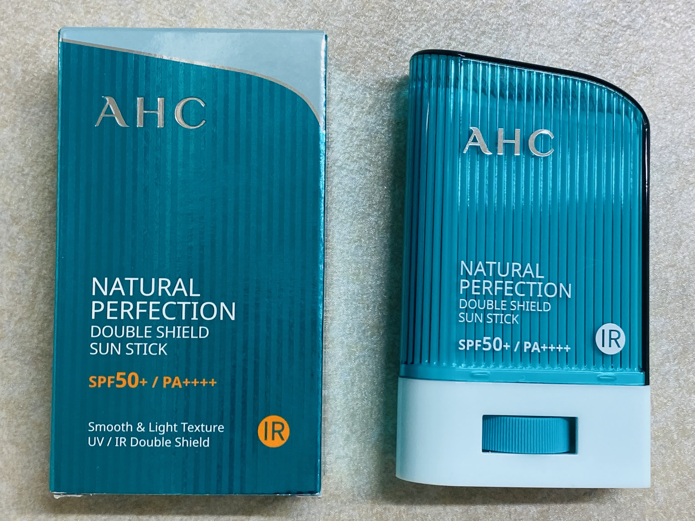

#### 夏が近づいてきましたね。。。。
本田翼さんがYouTubeでドクタージャルトの[スティックタイプの日焼け止め](https://www.amazon.co.jp/Dr-Jart-ドクタージャルトゥエブリ線デーサンスティック-SPF50-Every-Stick/dp/B07CYVGXC5)を紹介していました。
それを見て、スティックタイプの日焼け止めなんかあるんや！と気になって買ってみました。
本当は同じ物を買いたかったんですが、人気になりすぎて品切れで買えませんでした（泣）
そこで今回は、[Amazon]( https://www.amazon.co.jp/AHC-ナチュラルパーフェクションダブルシールドサンスティック-Natural-Perfection-Double/dp/B07TBYDY4J/)でAHCの**ナチュラルパーフェクションダブルシールドサンスティック**を買ってみました！ (スタバの呪文かな？笑)

---
箱はこんな感じ。注文してから1週間くらいで届きました。

	

 
キャップを開けて、下のホイールを回すとスティックが出てきます。

	

### 使用感
消しゴムで軽くこするような感じで塗ってみたんですが、あれ？？ ちゃんと塗れているのかな？？ と少し不安になりました。香りは爽やかな石鹸のような香りがします。
個人的に液体の日焼け止めのほうが肌に馴染んでしっかり守られているような気がします。
スティックタイプは、手を汚さずにササッと使えるので。外出中の塗り直しなどで便利そうだなと思いました！

  
p.s.
大阪の夏って東京よりムシムシしてて、暑く感じませんか（泣）